# Process_1

## Métadonnées

- **Processus BPMN** : `Process_1`
- **Fichier source** : `exemple.bpmn`
- **Tâches détectées** : 9
- **Gateways détectés** : 2
- **Scénarios** : 5
- **Scénarios alternatifs (événements limites)** : 0

## Vue d'ensemble

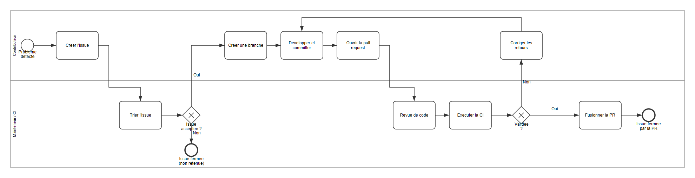

## Scénarios métier

### SC-01 — Contributeur (1 tâche(s))

- **Déclenché par** : « Probleme detecte »
- **Rôle** : Contributeur
- **Tâches** :
    - `Task_1` Creer l'issue
- **Relais vers** : Mainteneur / CI

### SC-02 — Mainteneur / CI (1 tâche(s))

- **Déclenché par** : « Probleme detecte »
- **Résultat(s)** : « Issue fermee (non retenue) »
- **Rôle** : Mainteneur / CI
- **Tâches** :
    - `Task_2` Trier l'issue
- **Relais vers** : Contributeur

### SC-03 — Contributeur (3 tâche(s))

- **Déclenché par** : « Probleme detecte »
- **Rôle** : Contributeur
- **Tâches** :
    - `Task_3` Creer une branche
    - `Task_4` Developper et committer
    - `Task_5` Ouvrir la pull request
- **Relais vers** : Mainteneur / CI

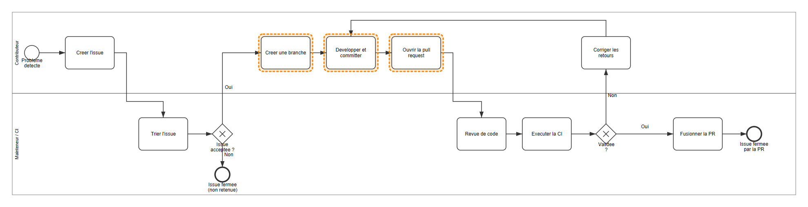

### SC-04 — Mainteneur / CI (3 tâche(s))

- **Déclenché par** : « Probleme detecte »
- **Résultat(s)** : « Issue fermee par la PR »
- **Rôle** : Mainteneur / CI
- **Tâches** :
    - `Task_6` Revue de code
    - `Task_7` Executer la CI
    - `Task_9` Fusionner la PR
- **Relais vers** : Contributeur

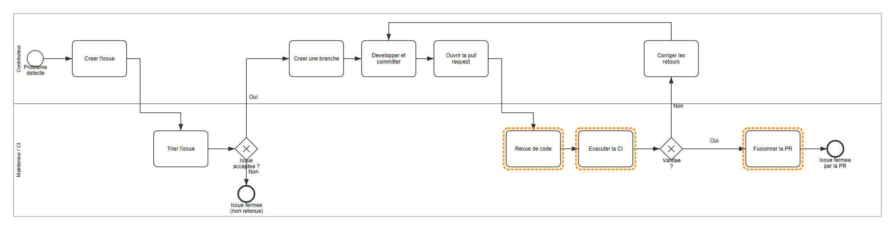

### SC-05 — Contributeur (1 tâche(s))

- **Déclenché par** : « Probleme detecte »
- **Rôle** : Contributeur
- **Tâches** :
    - `Task_8` Corriger les retours

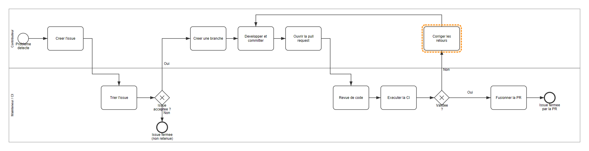

## Scénarios alternatifs (événements limites)

_Aucun événement limite (boundary event) détecté._

## User stories

### US-Task_1 — Creer l'issue

**En tant que** Contributeur,

**je veux** creer l'issue,

**afin de** faire progresser le processus métier.

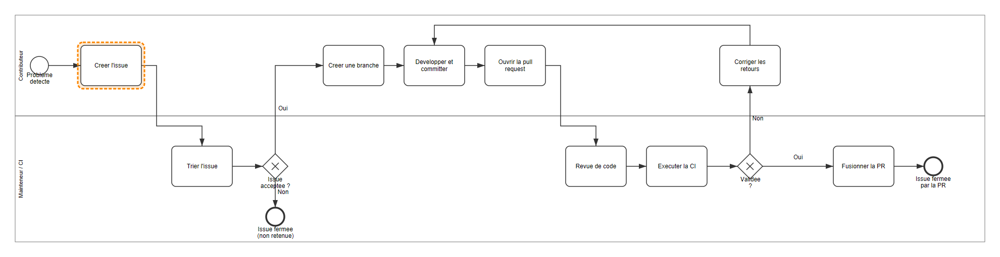

#### Critères d'acceptation

- Lorsque « Creer l'issue » est terminé, alors le processus poursuit vers « Trier l'issue ».

#### Traçabilité

- Élément BPMN : `Task_1`
- Type BPMN : `task`
- Lane / rôle : Contributeur

### US-Task_2 — Trier l'issue

**En tant que** Mainteneur / CI,

**je veux** trier l'issue,

**afin de** atteindre le résultat : Issue fermee (non retenue).

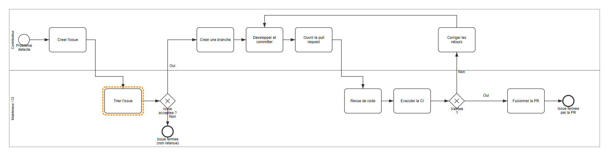

#### Critères d'acceptation

- Étant donné la condition « Non », lorsque « Trier l'issue » est terminé, alors le processus poursuit vers « Issue fermee (non retenue) ».
- Étant donné la condition « Oui », lorsque « Trier l'issue » est terminé, alors le processus poursuit vers « Creer une branche ».

#### Traçabilité

- Élément BPMN : `Task_2`
- Type BPMN : `task`
- Lane / rôle : Mainteneur / CI

### US-Task_3 — Creer une branche

**En tant que** Contributeur,

**je veux** creer une branche,

**afin de** faire progresser le processus métier.

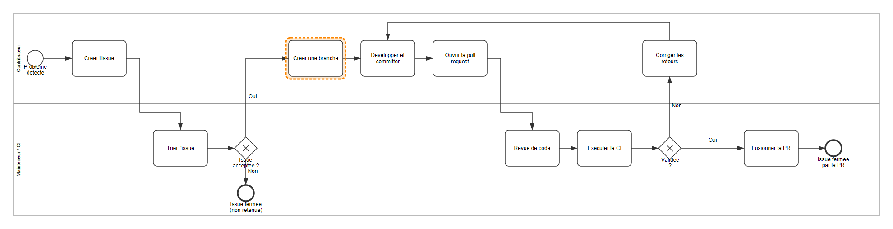

#### Critères d'acceptation

- Lorsque « Creer une branche » est terminé, alors le processus poursuit vers « Developper et committer ».

#### Traçabilité

- Élément BPMN : `Task_3`
- Type BPMN : `task`
- Lane / rôle : Contributeur

### US-Task_4 — Developper et committer

**En tant que** Contributeur,

**je veux** developper et committer,

**afin de** faire progresser le processus métier.

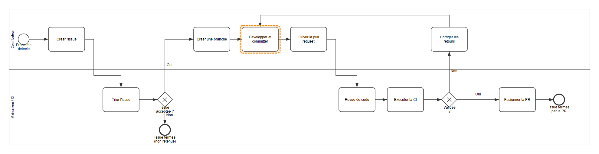

#### Critères d'acceptation

- Lorsque « Developper et committer » est terminé, alors le processus poursuit vers « Ouvrir la pull request ».

#### Traçabilité

- Élément BPMN : `Task_4`
- Type BPMN : `task`
- Lane / rôle : Contributeur

### US-Task_5 — Ouvrir la pull request

**En tant que** Contributeur,

**je veux** ouvrir la pull request,

**afin de** faire progresser le processus métier.

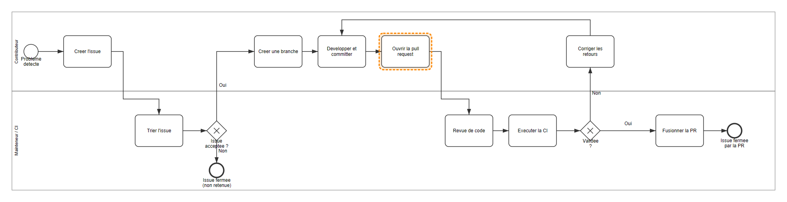

#### Critères d'acceptation

- Lorsque « Ouvrir la pull request » est terminé, alors le processus poursuit vers « Revue de code ».

#### Traçabilité

- Élément BPMN : `Task_5`
- Type BPMN : `task`
- Lane / rôle : Contributeur

### US-Task_6 — Revue de code

**En tant que** Mainteneur / CI,

**je veux** revue de code,

**afin de** faire progresser le processus métier.

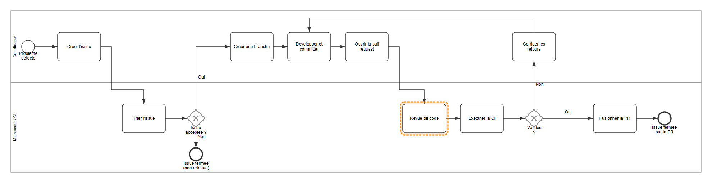

#### Critères d'acceptation

- Lorsque « Revue de code » est terminé, alors le processus poursuit vers « Executer la CI ».

#### Traçabilité

- Élément BPMN : `Task_6`
- Type BPMN : `task`
- Lane / rôle : Mainteneur / CI

### US-Task_7 — Executer la CI

**En tant que** Mainteneur / CI,

**je veux** executer la ci,

**afin de** faire progresser le processus métier.

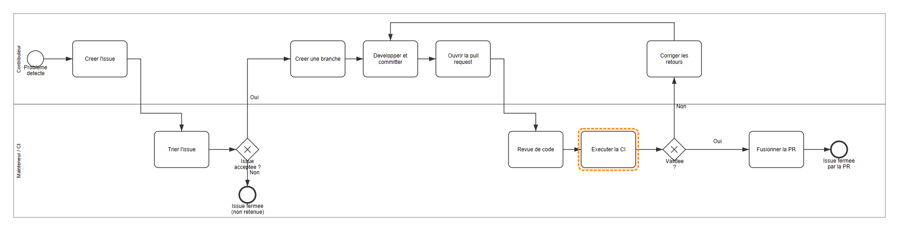

#### Critères d'acceptation

- Étant donné la condition « Non », lorsque « Executer la CI » est terminé, alors le processus poursuit vers « Corriger les retours ».
- Étant donné la condition « Oui », lorsque « Executer la CI » est terminé, alors le processus poursuit vers « Fusionner la PR ».

#### Traçabilité

- Élément BPMN : `Task_7`
- Type BPMN : `task`
- Lane / rôle : Mainteneur / CI

### US-Task_9 — Fusionner la PR

**En tant que** Mainteneur / CI,

**je veux** fusionner la pr,

**afin de** atteindre le résultat : Issue fermee par la PR.

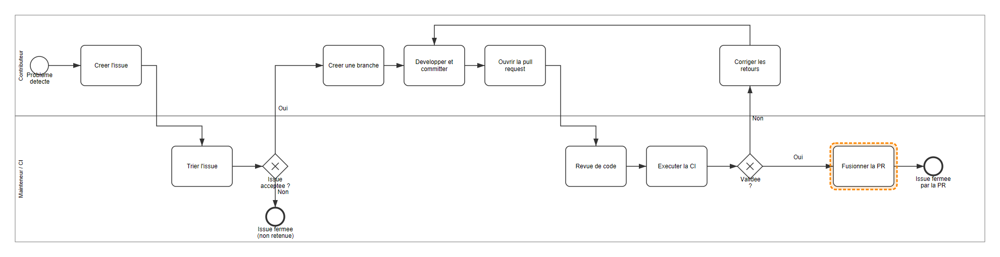

#### Critères d'acceptation

- Lorsque « Fusionner la PR » est terminé, alors le processus poursuit vers « Issue fermee par la PR ».

#### Traçabilité

- Élément BPMN : `Task_9`
- Type BPMN : `task`
- Lane / rôle : Mainteneur / CI

### US-Task_8 — Corriger les retours

**En tant que** Contributeur,

**je veux** corriger les retours,

**afin de** faire progresser le processus métier.

#### Critères d'acceptation

- Lorsque « Corriger les retours » est terminé, alors le processus poursuit vers « Developper et committer ».

#### Traçabilité

- Élément BPMN : `Task_8`
- Type BPMN : `task`
- Lane / rôle : Contributeur

## Règles de gestion candidates

- RG-Gateway_1-1: si « Non », alors orienter le processus vers « Issue fermee (non retenue) ».
- RG-Gateway_1-2: si « Oui », alors orienter le processus vers « Creer une branche ».
- RG-Gateway_1-EXCLUSIVITÉ: une seule branche sortante de « Issue acceptee ? » peut être sélectionnée.
- RG-Gateway_2-1: si « Non », alors orienter le processus vers « Corriger les retours ».
- RG-Gateway_2-2: si « Oui », alors orienter le processus vers « Fusionner la PR ».
- RG-Gateway_2-EXCLUSIVITÉ: une seule branche sortante de « Validee ? » peut être sélectionnée.

## Matrice de traçabilité

| ID BPMN | Type | Nom | Lane / rôle | User story | Scénario |
|---|---|---|---|---|---|
| `Task_1` | task | Creer l'issue | Contributeur | `US-Task_1` | SC-01 |
| `Task_2` | task | Trier l'issue | Mainteneur / CI | `US-Task_2` | SC-02 |
| `Task_3` | task | Creer une branche | Contributeur | `US-Task_3` | SC-03 |
| `Task_4` | task | Developper et committer | Contributeur | `US-Task_4` | SC-03 |
| `Task_5` | task | Ouvrir la pull request | Contributeur | `US-Task_5` | SC-03 |
| `Task_6` | task | Revue de code | Mainteneur / CI | `US-Task_6` | SC-04 |
| `Task_7` | task | Executer la CI | Mainteneur / CI | `US-Task_7` | SC-04 |
| `Task_9` | task | Fusionner la PR | Mainteneur / CI | `US-Task_9` | SC-04 |
| `Task_8` | task | Corriger les retours | Contributeur | `US-Task_8` | SC-05 |

## Vue atomique (par activité)

### Task_1 — Creer l'issue
- Type : `task` | Rôle : Contributeur
- [Voir sur le diagramme](images/exemple--process-1--activity-task-1.png)

### Task_2 — Trier l'issue
- Type : `task` | Rôle : Mainteneur / CI
- [Voir sur le diagramme](images/exemple--process-1--activity-task-2.png)

### Task_3 — Creer une branche
- Type : `task` | Rôle : Contributeur
- [Voir sur le diagramme](images/exemple--process-1--activity-task-3.png)

### Task_4 — Developper et committer
- Type : `task` | Rôle : Contributeur
- [Voir sur le diagramme](images/exemple--process-1--activity-task-4.png)

### Task_5 — Ouvrir la pull request
- Type : `task` | Rôle : Contributeur
- [Voir sur le diagramme](images/exemple--process-1--activity-task-5.png)

### Task_6 — Revue de code
- Type : `task` | Rôle : Mainteneur / CI
- [Voir sur le diagramme](images/exemple--process-1--activity-task-6.png)

### Task_7 — Executer la CI
- Type : `task` | Rôle : Mainteneur / CI
- [Voir sur le diagramme](images/exemple--process-1--activity-task-7.png)

### Task_9 — Fusionner la PR
- Type : `task` | Rôle : Mainteneur / CI
- [Voir sur le diagramme](images/exemple--process-1--activity-task-9.png)

### Task_8 — Corriger les retours
- Type : `task` | Rôle : Contributeur
- [Voir sur le diagramme](images/exemple--process-1--activity-task-8.png)
